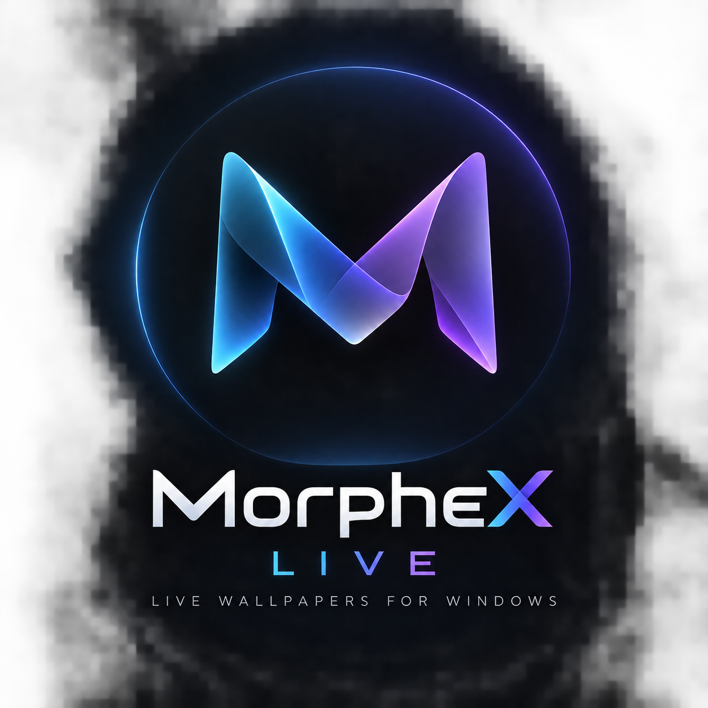

<p align="center">
  
</p>

<h1 align="center">MorpheX Live</h1>

<p align="center">
  A fast, lightweight live wallpaper engine for Windows 10 and 11.
</p>

<p align="center">
  
  
  
  
  
</p>

---

## Why MorpheX?

Most live wallpaper apps out there chew up 500MB to 1GB of memory and keep your GPU running hot even when you have a game running.

I built **MorpheX** to have something clean, minimal, and resource-friendly:
- When you are on your desktop, you get buttery-smooth 60fps video playback with hardware acceleration.
- The instant you launch a fullscreen game or open a work app, playback pauses immediately and drops to **0.0% CPU and 0.0% GPU**.
- It sits quietly in your system tray without spamming notifications or running background telemetry.

---

## Features

- **Direct3D 11 Hardware Acceleration**: Powered by LibVLC with native GPU decoding (`.mp4`, `.webm`, `.mov`, `.mkv`, `.gif`).
- **Smart Pause Detection**: Automatically freezes video playback when running fullscreen games or applications so your frame rates never take a hit.
- **Multi-Monitor Support**: Assign different wallpapers to each display, adjust volume independently per monitor, or mute individual screens.
- **Wallpaper Playlist & Auto-Rotation**: Shuffle or cycle through your library on a customizable timer. Filter by favorites. Postpones rotation while in a game.
- **Desktop Widgets**: Transparent, drag-and-drop overlays — Clock, Day Name, System Monitor (CPU/GPU/RAM/Disk), Audio Visualizer, Calendar, Notes, and Motivational Quotes.
- **Taskbar Styling**: Apply Clear, Blur (Aero Glass), or Acrylic (Frosted Glass) effects to your taskbar — including secondary monitor taskbars. Resets automatically when MorpheX exits.
- **System Monitor Widget**: Simplicity Circles showing real-time CPU, GPU, RAM, and Disk usage. Supports multi-GPU setups with discrete GPU tracking.
- **Audio Visualizer**: Reactive bar, mirrored, or waveform visualizer synced to your system audio, with an optional neon glow toggle.
- **Custom Global Hotkeys**: Set keyboard shortcuts to pause/resume, mute/unmute, or skip wallpapers from anywhere in Windows.
- **Native Windows Shell Integration**: Embeds cleanly behind your desktop icons using the `WorkerW` layer without interfering with desktop clicks.
- **1-Click Built-in Updates**: Check for and install updates directly inside the app.
- **Fast Startup**: Optimized desktop integration initialization — typically under 1 second on most systems.

---

## Installation

### Installer (Recommended)
Grab the latest setup from the [**Releases**](https://github.com/MorpheusDark7/MorpheX/releases) page:
1. Download `MorpheX-Live-Setup-v*.exe`.
2. Run the installer and click Next.
3. Launch MorpheX from your Start Menu or Desktop.

*(Future updates can be installed with a single click right inside the app settings.)*

---

## Supported Formats

| Format | Extensions | Engine |
|---|---|---|
| **Video** | `.mp4`, `.webm`, `.mkv`, `.mov`, `.avi` | LibVLC with Direct3D 11 GPU decode |
| **Animated** | `.gif` | Native hardware WPF renderer |
| **Static** | `.png`, `.jpg`, `.jpeg`, `.webp`, `.bmp` | Fast WIC image loader |

---

## Building from Source

### Requirements
- Windows 10 (1809+) or Windows 11 (64-bit)
- [.NET 8.0 SDK](https://dotnet.microsoft.com/download/dotnet/8.0)
- Visual Studio 2022, JetBrains Rider, or VS Code

### Steps
```powershell
# 1. Clone the repository
git clone https://github.com/MorpheusDark7/MorpheX.git
cd MorpheX

# 2. Restore NuGet dependencies
dotnet restore

# 3. Build in Release mode
dotnet build -c Release

# 4. (Optional) Publish a self-contained single executable
dotnet publish src/MorpheX/MorpheX.csproj -c Release -r win-x64 --self-contained -p:PublishSingleFile=true -o ./publish
```

To compile the setup installer, open `installer.iss` in [Inno Setup 6](https://jrsoftware.org/isinfo.php) and click **Compile**.

---

## Architecture Overview

```
MorpheX/
├── src/
│   ├── MorpheX/             # WPF Front-end UI (MVVM, Fluent Design, Views, Widgets)
│   └── MorpheX.Core/        # Core Engine
│       ├── Configuration/   # App settings & library manifests
│       ├── Desktop/         # Win32 WorkerW shell integration & host windows
│       ├── Detection/       # Fullscreen, battery, and Explorer restart watchers
│       ├── Models/          # Monitor, wallpaper, and performance data models
│       ├── Providers/       # Video (LibVLC) and image wallpaper providers
│       ├── Services/        # Playback, playlist, audio, metrics, and update services
│       └── Utilities/       # Win32 memory trimming & shell thumbnail helpers
├── installer.iss            # Inno Setup packaging script
└── .github/workflows/       # GitHub Actions CI/CD pipeline
```

---

## Changelog

### v0.1.30
- **Taskbar Styling** — Built-in Clear, Blur, and Acrylic taskbar effects (primary + all secondary monitors). Resets to default when MorpheX closes.
- **Faster Startup** — Reduced WorkerW initialization overhead: single spawn message, shorter sleep intervals, and fewer retry attempts.
- **Widget Tips** — Cleaned up the Desktop Tips card in the Widgets page.
- **CI Fix** — Fixed GitHub Actions deploy step that was dropping the installer before copying to `docs/`.

### v0.1.29
- Fixed CI deploy step (copy installer to TEMP before branch switch).

### v0.1.28
- Toggleable neon glow for the audio visualizer.
- Frosted glass acrylic background option for the Media widget.
- Optimized installer size by stripping unused VLC architecture runtimes.
- Auto-deploy installer to GitHub Pages for direct download.

### v0.1.27
- Acrylic frosted glass widget backgrounds.
- Multi-GPU engine tracking (dGPU load for discrete GPUs).
- Hide resize grips when widgets are locked.
- Mond / Anurati font support for Day widget.

---

## License

Released under the [MIT License](LICENSE). Free for personal and commercial use.
